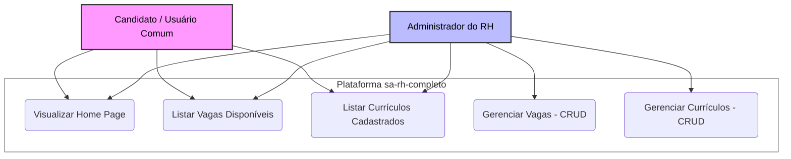

# Especificação de Requisitos de Software (SRS)
**Projeto:** Plataforma RH
**Versão:** 1.0.0
**Data:** 2026-06-23

## 1. Introdução
### 1.1 Propósito
Este documento descreve os requisitos funcionais e não funcionais para o Módulo de Currículos e Vagas da Plataforma de RH. O objetivo deste módulo é permitir que candidatos gerenciem suas informações profissionais e que a administração visualize esses dados.

### 1.2 Escopo
O sistema compreende o desenvolvimento de uma interface frontend em Angular integrada a um backend simulado (json-server). As funcionalidades incluem o CRUD completo de currículos, vinculação de dados por ID de usuário e interface administrativa para gestão.

---

## 2. Descrição Geral
O sistema consiste em uma aplicação web desenvolvida em Angular para simular um ecossistema de Recursos Humanos. A arquitetura é composta por uma página inicial (Home Page) de apresentação geral e telas específicas para listagem de vagas e listagem de currículos. O gerenciamento administrativo é realizado por meio de painéis dedicados para o controle de vagas e de currículos, onde o usuário pode realizar inserções, consultas, modificações e exclusões de registros. A persistência de dados é simulada localmente por meio do json-server operando como API REST na porta 3000.

## 3. Requisitos do Sistema 

### 3.1 Requisitos Funcionais (RF)
* **RF01 - Apresentação (Home Page):** O sistema deve exibir uma página inicial com informações e textos institucionais/genéricos de apresentação da plataforma.
* **RF02 - Listagem de Vagas:** O sistema deve exibir uma tela com a listagem de todas as vagas de emprego disponíveis.
* **RF03 - Listagem de Currículos:** O sistema deve exibir uma tela com a listagem de todos os currículos profissionais cadastrados.
* **RF04 - CRUD de Vagas (Painel de Vagas):** O sistema deve disponibilizar um painel administrativo que permita cadastrar, visualizar, atualizar e excluir vagas de emprego.
* **RF05 - CRUD de Currículos (Painel de Currículos):** O sistema deve disponibilizar um painel administrativo que permita cadastrar, visualizar, atualizar e excluir currículos.

### 3.2 Requisitos Não-Funcionais (RNF)
* **RNF01 - Tecnologia do Frontend:** O sistema deve ser desenvolvido utilizando o framework Angular em sua versão mais recente, com TypeScript.
* **RNF02 - Simulador de API (Backend):** O armazenamento e simulação dos dados devem ser feitos exclusivamente via json-server através de um arquivo db.json local.
* **RNF03 - Ambiente de Execução:** O projeto deve depender apenas do ambiente de execução Node.js instalado na máquina local para o gerenciamento de suas dependências.

## 4. Interface de Dados e Modelagem do Sistema

### 4.1 Diagramas

#### 4.1.1 Diagrama de Uso


#### 4.1.2 Diagrama de Classe

##### Modelo: vaga.model.ts
```ts
class Vaga {
  //Construtor Encurtado //
  constructor(
    public id: number,
    public nome: string,
    public foto: string,
    public descricao: string,
    public salario: number,
  ) {}
```

##### Modelo: curriculo.model.ts
```ts
class Curriculo {
  // Construtor Encurtado //
  constructor(
    public id: number,
    public nome: string,
    public idade: number,
    public foto: string,
    public descricao: string,
    public experiencias: string,
    public titulosEcargos: string
  ) {}
```

#### 4.1.3 Diagrama de Fluxo
*(Espaço reservado para o desenho técnico do fluxo de navegação: Home -> Listagens/Painéis -> Requisições HTTP para a porta 3000)*

## 5. Critérios de Aceitação

1.  **Operação CRUD:** É possível criar, ler, atualizar e excluir um registro no db.json através da interface?
2.  **Navegação:** As rotas configuradas levam aos componentes corretos sem erros de console?
3.  **Feedback:** O usuário recebe uma confirmação (ex: MatSnackBar) ao salvar um currículo?
4.  **Consistência:** Os dados exibidos na listagem correspondem exatamente ao que está no backend simulado?

## 6. Configuração do Ambiente

### Estrutura de Pastas Principal
sa-rh-completo/
├── backend/
│   └── db.json                 # Banco de dados simulado (JSON Server)
└── src/
    └── app/
        ├── model/
        │   ├── curriculo.model.ts
        │   └── vaga.model.ts
        ├── service/
        │   ├── curriculo.service.ts
        │   └── vaga.service.ts
        └── view/
            ├── curriculos/
            ├── fragmentos/
            ├── inicio/
            ├── painel-curriculos/
            ├── painel-vagas/
            └── vagas/

### Instruções para Execução

1. **Instalação de Dependências:**
Instale os pacotes necessários definidos no projeto utilizando o gerenciador de pacotes do Node:
npm install

2. **Inicialização do Banco de Dados Simulado (Backend):**
Execute o json-server apontando para o arquivo local na porta 3000 em um terminal dedicado:
json-server backend/db.json --port=3000

3. **Inicialização da Aplicação (Frontend):**
Em um segundo terminal, inicie o servidor de desenvolvimento do Angular através do Angular CLI:
ng serve
